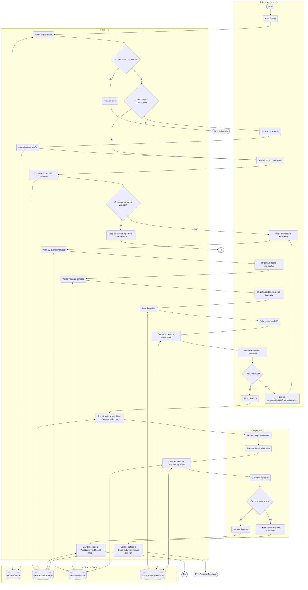

# 📊 Flujo BPMN: Sistema de Gestión Financiera Educativa

Este documento describe el flujo de procesos de negocio (BPMN) base del sistema, mapeado a través de 4 carriles (pools/lanes) principales:

1. **👨‍🏫 Director de la I.E.** (Usuario declarante)
2. **⚙️ Sistema** (Lógica de negocio, frontend/backend)
3. **🗄️ Base de Datos** (Almacenamiento y persistencia)
4. **🕵️ Especialista** (Auditor de UGEL)

---

## 1. Diagrama de Flujo (Mermaid)

*Nota: Si tu visor de Markdown soporta Mermaid, verás el diagrama renderizado a continuación.*

---

## 2. Descripción Paso a Paso del Flujo

### Fase A: Inicio y Autenticación
1. **[Director]** Inicia sesión ingresando sus credenciales.
2. **[Sistema]** Toma las credenciales y las valida consultando a la **[Base de Datos]**.
3. **[Sistema]** ¿Credenciales correctas?
   - **No:** Muestra mensaje de error -> **Fin / Reintentar**.
   - **Sí:** Verifica el rol del usuario y avanza.
4. **[Sistema]** Verifica: ¿Debe cambiar contraseña?
   - **Sí:** **[Director]** cambia la contraseña -> **[Sistema]** actualiza y guarda en la **[Base de Datos]**.
   - **No:** Continúa directamente.

### Fase B: Configuración del Trimestre
5. **[Director]** Selecciona el año y trimestre sobre el cual va a declarar.
6. **[Sistema]** Consulta el estado del trimestre en la **[Base de Datos]**.
7. **[Sistema]** ¿Trimestre cerrado o vencido?
   - **Sí:** Bloquea edición y permite solo acceso en modo consulta/exportación -> **Fin**.
   - **No:** Continúa habilitando la edición.

### Fase C: Declaración Financiera
8. **[Director]** Registra ingresos mensuales.
9. **[Sistema]** Valida y guarda los ingresos en la **[Base de Datos]**.
10. **[Director]** Registra egresos mensuales.
11. **[Sistema]** Valida y guarda los egresos en la **[Base de Datos]**.
12. **[Director]** Registra saldos de cuenta bancaria.
13. **[Sistema]** Guarda los saldos en la **[Base de Datos]**.
14. **[Director]** Sube sustentos en PDF.
15. **[Sistema]** Guarda los archivos y la metadata en la **[Base de Datos]** y almacenamiento de archivos.

### Fase D: Consolidación y Envío
16. **[Director]** Revisa el consolidado trimestral.
17. **[Director]** ¿Información completa y correcta?
    - **No:** Corrige ingresos, egresos, saldos o documentos y vuelve a revisar.
    - **Sí:** Presiona el botón para cerrar el trimestre.
18. **[Sistema]** Registra el cierre, cambia el estado en la **[Base de Datos]** a **"Enviado"** y bloquea la edición del director.

### Fase E: Revisión y Auditoría
19. **[Especialista]** Revisa la lista de colegios que están en estado "Enviado".
20. **[Especialista]** Abre el detalle de una institución específica.
21. **[Sistema]** Extrae la información de la **[Base de Datos]** y muestra el resumen financiero y los PDFs.
22. **[Especialista]** Evalúa la declaración.
23. **[Especialista]** ¿Declaración correcta?
    - **Sí:** Hace clic en *"Aprobar informe"*.
      - **[Sistema]** cambia el estado en la **[Base de Datos]** a **"Aprobado"**, notifica al director.
      - **Fin**.
    - **No:** Hace clic en *"Observar informe"* e ingresa un comentario con el motivo.
      - **[Sistema]** cambia el estado en la **[Base de Datos]** a **"Observado"**, desbloquea la vista del director y le notifica.
      - **Fin / Revisión posterior**.